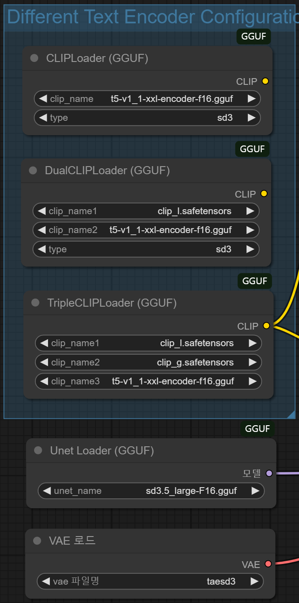

# Window에서 ComfyUI로 Stable-diffusion-3.5-large GGUF 사용하기

1. 반디집 설치 필요!

2. ComfyUI 설치 파일 다운로드 + 압축 풀기

    - `./sh getting-start.sh`

3. .\ComfyUI_windows_portable\ComfyUI\requirements.txt 설치

4. Git 설치 (git clone 하기 위함. 있으면 생략)
    - 64-bit Git for windows Setup 다운로드
        - https://git-scm.com/downloads/win

5. ComfyUI manager 설치
    - [Install Missing Custom Nodes] 
        - 새로운 ComfyUI workflow를 불러왔을때 자동으로 설치해야 하는 custom node들을 인식하여 편리함
    - [Update All]
        - ComfyUI update를 한번에 해줘서 편리함
    - `cd .\ComfyUI_windows_portable\ComfyUI\custom_nodes`
       
      `git clone https://github.com/ltdrdata/ComfyUI-Manager`
        
6. main.py 실행하여 ComfyUI manager 설치 확인
    - 우측 상단에 manager 버튼
    - 여기서 ComfyUI workflow 불러왔을때 [Update All] 버튼 클릭, 설치 안된 custom node 있으면 [Install Missing Custom Nodes]로 설치

7. hugging face에서 아래 파일들을 다운로드해 각 폴더에 추가
    - .\ComfyUI_windows_portable\ComfyUI\models\clip
        - clip_g.safetensors
            - https://huggingface.co/stabilityai/stable-diffusion-3.5-large/tree/main/text_encoders
        - clip_l.safetensors
            - https://huggingface.co/stabilityai/stable-diffusion-3.5-large/tree/main/text_encoders
        - t5-v1_1-xxl-encoder-f16.gguf
            - https://huggingface.co/city96/t5-v1_1-xxl-encoder-gguf/tree/main

    - .\ComfyUI_windows_portable\ComfyUI\models\unet
        - sd3.5_large-F16.gguf
            - https://huggingface.co/city96/stable-diffusion-3.5-large-gguf/tree/main

    - .\ComfyUI_windows_portable\ComfyUI\models\vae
        - diffusion_pytorch_model.safetensors
            - https://huggingface.co/stabilityai/stable-diffusion-3.5-large/tree/main/vae

8. Stable diffusion workflow 다운로드
    - https://blog.kakaocdn.net/dn/oRTfr/btsL458XTO5/MwekV1H5bidsFy6ibvbaLK/SD3.5-GGUF.json?attach=1&knm=tfile.json

9. main.py 실행 

10. http://127.0.0.1:8188/ 접속

11. SDModel.json을 해당 페이지에 drag & drop

12. 아래 그림과 같이 clip / Unet / VAE 로더 설정 

13. Prompt 작성 후 왼쪽 하단 파란색 실행 큐 버튼 클릭

## Trouble Shooting
- Workflow를 불러온 후 [Install Missing Custom Nodes]로 설치했는데 오류가 발생하는 경우
    - custom node 명을 구글링해 git clone하면 됨!